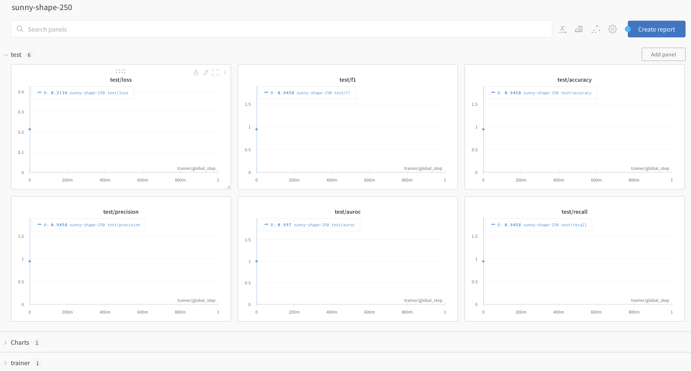
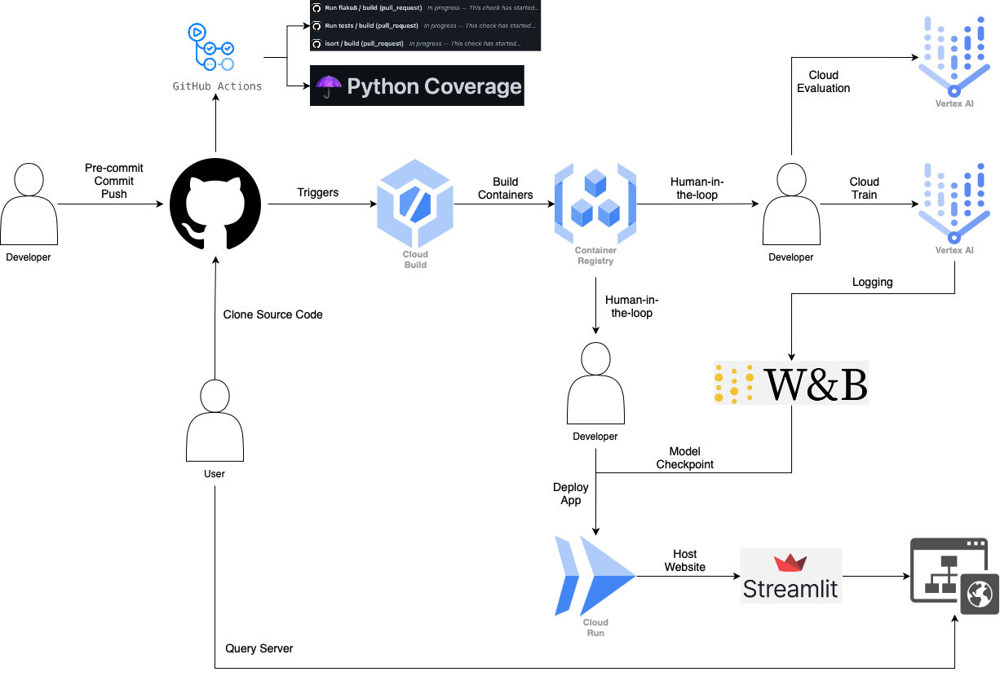

# Exam template for 02476 Machine Learning Operations

This is the report template for the exam. Please only remove the text formatted as with three dashes in front and behind
like:

```--- question 1 fill here ---```

where you instead should add your answers. Any other changes may have unwanted consequences when your report is auto
generated in the end of the course. For questions where you are asked to include images, start by adding the image to
the `figures` subfolder (please only use `.png`, `.jpg` or `.jpeg`) and then add the following code in your answer:

```markdown

```

In addition to this markdown file, we also provide the `report.py` script that provides two utility functions:

Running:

```bash
python report.py html
```

will generate an `.html` page of your report. After deadline for answering this template, we will autoscrape
everything in this `reports` folder and then use this utility to generate an `.html` page that will be your serve
as your final handin.

Running

```bash
python report.py check
```

will check your answers in this template against the constrains listed for each question e.g. is your answer too
short, too long, have you included an image when asked to.

For both functions to work it is important that you do not rename anything. The script have two dependencies that can
be installed with `pip install click markdown`.

## Group information

### Question 1
> **Enter the group number you signed up on <learn.inside.dtu.dk>**
>
> Answer:

Group number: 16

### Question 2
> **Enter the study number for each member in the group**
>
> Example:
>
> *sXXXXXX, sXXXXXX, sXXXXXX*
>
> Answer:

s204096, s204162, s204071, s204154.

### Question 3
> **What framework did you choose to work with and did it help you complete the project?**
>
> Answer length: 100-200 words.
>
> Example:
> *We used the third-party framework ... in our project. We used functionality ... and functionality ... from the*
> *package to do ... and ... in our project*.
>
> Answer:

Multiple frameworks were used for the project. The cookiecutter repo-format is used to help the reproducibility of the project. This project will use [Torchvision](https://pytorch.org/vision/stable/index.html) in order to obtain the ResNet18 model and to initially download the CIFAR10 data. The model is then slightly modified with PyTorch. Moreover, we use the [Pytorch-lightning](https://pytorch-lightning.readthedocs.io/en/stable/) framework to reduce the boilerplate for training the model on GPUs, for loading data with datamodules for ease of use, and for logging our experiments to WandB. We also use the framework [Torchmetrics](https://torchmetrics.readthedocs.io/en/stable/) for calculating accuracies and other metrics during training, validation and testing. Then, we used hydra for parameter configuration of our runs. Finally, we used [Docker](https://github.com/docker) for building reproducible images for both training, prediction and our application. For deployment of the trained model, we used [Streamlit](https://github.com/streamlit/streamlit) to make it possible for users to upload images and classify them.

## Coding environment

> In the following section we are interested in learning more about you local development environment.

### Question 4

> **Explain how you managed dependencies in your project? Explain the process a new team member would have to go**
> **through to get an exact copy of your environment.**
>
> Answer length: 100-200 words
>
> Example:
> *We used ... for managing our dependencies. The list of dependencies was auto-generated using ... . To get a*
> *complete copy of our development enviroment, one would have to run the following commands*
>
> Answer:

We managed dependencies with the pipreqs-package. Using the pipreqs-command in the repository generates a requirements textfile. This includes the packages and their version which are necessary to get the full outcome of this project. For a new user to obtain the dependencies, one will need to run ```pip install -r requirements.txt``` in the terminal of the repo. Also, a Makefile has been made for the project, which decreases the complexity of the commands in the terminal. In this case, one can instead run the command ````make requirements``` in the terminal. Preferably these commands should be used with a new virtual environment, for example created with conda. These two steps can also be combined, since the the environment can be initiated with conda from the requirements file by using the command ```conda create --name <name_of_env > --file requirements.txt``` or simply ```make create_environment``` again with the help pf the makefile.

### Question 5

> **We expect that you initialized your project using the cookiecutter template. Explain the overall structure of your**
> **code. Did you fill out every folder or only a subset?**
>
> Answer length: 100-200 words
>
> Example:
> *From the cookiecutter template we have filled out the ... , ... and ... folder. We have removed the ... folder*
> *because we did not use any ... in our project. We have added an ... folder that contains ... for running our*
> *experiments.*
> Answer:

In the cookiecutter template, the group has filled out the folders: _models_, _reports_, _src_ (not /features/) and _test_. The folders _references_, _docs_ and _notebooks_. are removed. Multiple new folders are made:  _.dvc_ handles data versioning. The _app_ directory which is where the streamlit model deployment code is stored. The _dockerfiles_ directory has also been added to prevent unnecessary clutter from the dockerfiles in the root directory of the project. We also added a subdirectory, _callbacks_ in the _src/models_ folder, where we store the hooks for the Pytorch-Lightning modules. We also added a subdirectory, _utils_, in the _src/_ directory to store functions that spans multiple domains.

### Question 6

> **Did you implement any rules for code quality and format? Additionally, explain with your own words why these**
> **concepts matters in larger projects.**
>
> Answer length: 50-100 words.
>
> Answer:

We used Black to format our code such that it is PEP 8 compliant, which Flake8 then checks. We also used isort to handle imports properly. It is very important to keep a consistent code style throughout the project, since it is easier readable for new users and internally in the group when doing debugging/assisting each other with code writing. We chose to change the line length from 79 to 88, to accomodate Black's formatting.

## Version control

> In the following section we are interested in how version control was used in your project during development to
> corporate and increase the quality of your code.

### Question 7

> **How many tests did you implement?**
>
> Answer:

We have five tests, split in model tests and data tests.

### Question 8

> **What is the total code coverage (in percentage) of your code? If you code had an code coverage of 100% (or close**
> **to), would you still trust it to be error free? Explain you reasoning.**
>
> **Answer length: 100-200 words.**
>
> Example:
> *The total code coverage of code is X%, which includes all our source code. We are far from 100% coverage of our **
> *code and even if we were then...*
>
> Answer:

We have 28% coverage, with our tests. We are only testing core modules, as the data and the model right now. We do not fully expect our code to be error free, as there are always edge-cases, even if we got up to 100% coverage. It is also hard to attain 100% coverage. This is though a good indicator if your tests are actually doing something. In the future, we could probably add more tests that test some of the runner-code, for example when running the actual training. The webapp is also not currently tested, and contains a decent amount of code.

### Question 9

> **Did you workflow include using branches and pull requests? If yes, explain how. If not, explain how branches and**
> **pull request can help improve version control.**
>
> Answer length: 100-200 words.
>
> Example:
> *We made use of both branches and PRs in our project. In our group, each member had an branch that they worked on in*
> *addition to the main branch. To merge code we ...*
>
> Answer:

We used both branches and pull-requests. All features were added as feature branches, as the main branch is protected so you cannot push into it directly. Each group member worked on individual branches for every feature, fix or chore. This is much nicer when you are 4 people working together, as everyone can contribute on their own branch. To merge the code we created pull-requests, which were put through our CI pipeline, so that our tests were run, and our linting and formatting happened. Finally the PR was reviewed by at least one other group member before being allowed to merge into the main branch.

### Question 10

> **Did you use DVC for managing data in your project? If yes, then how did it improve your project to have version**
> **control of your data. If no, explain a case where it would be beneficial to have version control of your data.**
>
> Answer length: 100-200 words.
>
> Example:
> *We did make use of DVC in the following way: ... . In the end it helped us in ... for controlling ... part of our*
> *pipeline*
>
> Answer:

We did use DVC for controlling our data workflow. It was definetely easier to ensure that everyone had the same version of the dataset across all their multiple devices/distros. It is really easy to just `dvc pull`, and because we set it up in a bucket, it was accessible anywhere. While there was only one verison of the data throughout the project, one could easily imagine a case where multiple versions were necessary, and DVC would be an important tool. Our classifier only classifies 10 classes at the moment, however, it could be expanded by adding more data of new classes. In that case, it would be beneficial to have multiple version of the data to test back and forth.

### Question 11

> **Discuss you continues integration setup. What kind of CI are you running (unittesting, linting, etc.)? Do you test**
> **multiple operating systems, python version etc. Do you make use of caching? Feel free to insert a link to one of**
> **your github actions workflow.**
>
> Answer length: 200-300 words.
>
> Example:
> *We have organized our CI into 3 separate files: one for doing ..., one for running ... testing and one for running*
> *... . In particular for our ..., we used ... .An example of a triggered workflow can be seen here: <weblink>*
>
> Answer:

We used a couple of CI integrations. First we used pre-commit to make sure our CI pipelines did not fail. The pre-commit hooks made a series of checks: checking whitespaces, end-of-file newline, correct yaml-files, not to large files comitted (with a maximum of 500kB), python syntax. Then also running black, isort, and flake8. We then use four workflows: Flake8 for linting to make sure that our code is PEP8 compliant, isort to make sure that our imports follow a consistent format, a tests workflow running our tests, and finally a coverage workflow for providing a coverage report on every PR. An example of the workflow can be seen here: [Actions](https://github.com/radziko/colo_mlops/pull/37/checks) and the coverage can be seen in the [PR](https://github.com/radziko/colo_mlops/pull/37). We actually chose to not test on multiple operating systems because of time constraints; whenever, we ran the actions, it would take a long time before our action was picked up by Windows and MacOS machines. Optimally, we would have done this. Moreover, we also only unittested on Python 3.9, since it is the only version we use throughout the entire projects. Our GitHub actions are triggered whenever a pull request is created or when a pull request has been merged into _main_.

## Running code and tracking experiments

> In the following section we are interested in learning more about the experimental setup for running your code and
> especially the reproducibility of your experiments.

### Question 12

> **How did you configure experiments? Did you make use of config files? Explain with coding examples of how you would**
> **run a experiment.**
>
> Answer length: 50-100 words.
>
> Example:
> *We used a simple argparser, that worked in the following way: python my_script.py --lr 1e-3 --batch_size 25*
>
> Answer:

We used Hydra to configure our experiments, such that it provided all the variables for training and testing. We would start it like this:
```python src/models/train_model.py```
This would use the default configuration, but you could overwrite the parameters like this:
```python src/models/train_model.py training.batch_size=64```
This would change the default batch size defined in the _configs/training/default_train.yaml_.

### Question 13

> **Reproducibility of experiments are important. Related to the last question, how did you secure that no information**
> **is lost when running experiments and that your experiments are reproducible?**
>
> Answer length: 100-200 words.
>
> Example:
> *We made use of config files. Whenever an experiment is run the following happens: ... . To reproduce an experiment*
> *one would have to do ...*
>
> Answer:

We primarily used Wandb to store hyperparameters for each run, and experiments. All hyperparameteres were logged each time we started an experiment. We should probably have created new config files for each run, but it was easier to overwrite the original experiment file and save it to Wandb instead. This was because we changed between training locally and in the cloud a multitude of times. To reproduce an experiment, you would have to grab the hyperparameters from the run you want to reproduce, and then use them in a Hydra file, or overwrite the parameters with arguments passed to the training scripts.

### Question 14

> **Upload 1 to 3 screenshots that show the experiments that you have done in W&B (or another experiment tracking**
> **service of your choice). This may include loss graphs, logged images, hyperparameter sweeps etc. You can take**
> **inspiration from [this figure](figures/wandb.png). Explain what metrics you are tracking and why they are**
> **important.**
>
> Answer length: 200-300 words + 1 to 3 screenshots.
>
> Example:
> *As seen in the first image when have tracked ... and ... which both inform us about ... in our experiments.*
> *As seen in the second image we are also tracking ... and ...*
>
> Answer:

Training: 
Validation: 
Test: 

As seen in the first image, we're tracking our training. We're both tracking training loss, and the accuracy as well as the AUROC score. This informs us how the training is progressing, and if we are in fact reducing loss as well as increase our accuracy over time. Also, WanDB plays an important role regarding the model checkpoints, since these are stored here after training with a version tag.

The second image shows our validation samples with the same metrics as for training. Also, there it contains images in the validation set. We see an image with what the model predicted and what the ground truth of the image is. This is a good sanity check, as it allows us to visually check whether the model is working or not.

The third image shows a test run. Here are the same metrics as above and the F1-score, precision and recall as well. Since there is no class imbalance in the data set, the new metrics might not be the most important, however, it can become important if the data set is expanded and thereby changes shape. Since the metrics are not dependent of epochs, they could probably be visualized in a better way.

### Question 15

> **Docker is an important tool for creating containerized applications. Explain how you used docker in your**
> **experiments? Include how you would run your docker images and include a link to one of your docker files.**
>
> Answer length: 100-200 words.
>
> Example:
> *For our project we developed several images: one for training, inference and deployment. For example to run the*
> *training docker image: `docker run trainer:latest lr=1e-3 batch_size=64`. Link to docker file: <weblink>*
>
> Answer:

We used Docker in the project for building three different images. One for training our model, one for getting specific inference and one for deploying our webapp with the finished model in the cloud. This was done with Cloud build and Container Registery.

All the images were of course deployed in the different GCP services, according to which one was most fitting for the specific image (Train: Vertex AI, Predict: Vertex AI, Webapp: Cloud Run).
They can all be built easily, by using the make commands:

```make docker_build_train ```

```make docker_build_predict ```

```make docker_build_app ```

To run the web-app locally, you would run: `docker run --env-file .env -p 8501:8501 app:latest`
Here is a link to the file: [app.dockerfile](https://github.com/radziko/colo_mlops/blob/main/dockerfiles/app.dockerfile)

To run the others, you can use similar commands, or use the make commands:

```make docker_train ```

```make docker_predict```

```make docker_deploy_app_local ```

```make docker_deploy_app_cloud ```


### Question 16

> **When running into bugs while trying to run your experiments, how did you perform debugging? Additionally, did you**
> **try to profile your code or do you think it is already perfect?**
>
> Answer length: 100-200 words.
>
> Example:
> *Debugging method was dependent on group member. Some just used ... and others used ... . We did a single profiling*
> *run of our main code at some point that showed ...*
>
> Answer:

Debugging depends on which member of the group is coding, as we all prefer different IDE's and are using different operating systems. One of us used the debugger in PyCharm, another one of us used VSCode's debugger, and others were using PDB directly.
Of course, in the heat of the moment, periodically we just used a dirty print-statement. It happens to the best of us.
At one point, we had to use profiling, as we had a bad memory leak. The training just began slowing down heavily, and was allocating all of the GPU video ram. We luckily managed to find the leak, and plug it.

## Working in the cloud

> In the following section we would like to know more about your experience when developing in the cloud.

### Question 17

> **List all the GCP services that you made use of in your project and shortly explain what each service does?**
>
> Answer length: 50-200 words.
>
> Example:
> *We used the following two services: Engine and Bucket. Engine is used for... and Bucket is used for...*
>
> Answer:

GCP IAM: Permissions for sharing the project.

Cloud Storage: Bucket for hosting data.

Cloud Build: We use triggers here to build our docker images from PR's in Github.

Container Registry: Stores our built images from Cloud Build.

Vertex AI: Run our containers, when we're training in the cloud.

Cloud Run: Run our container for the webapp.

### Question 18

> **The backbone of GCP is the Compute engine. Explained how you made use of this service and what type of VMs**
> **you used?**
>
> Answer length: 50-100 words.
>
> Example:
> *We used the compute engine to run our ... . We used instances with the following hardware: ... and we started the*
> *using a custom container: ...*
>
> Answer:

We ended up not using Compute Engine at all, as we did not see the benefit of spinning up a whole VM for our project. Vertex AI allowed us to use our training image directly from the Container Registry, and is more lightweight. For running our webapp, we used Cloud Run instead, as it also is a lot more lightweight, and requries less configuration to use. Cloud Run was started using the webapp image from the Container Registry.

### Question 19

> **Insert 1-2 images of your GCP bucket, such that we can see what data you have stored in it.**
> **You can take inspiration from [this figure](figures/bucket.png).**
>
> Answer:


### Question 20

> **Upload one image of your GCP container registry, such that we can see the different images that you have stored.**
> **You can take inspiration from [this figure](figures/registry.png).**
>
> Answer:


### Question 21

> **Upload one image of your GCP cloud build history, so we can see the history of the images that have been build in**
> **your project. You can take inspiration from [this figure](figures/build.png).**
>
> Answer:

.

### Question 22

> **Did you manage to deploy your model, either in locally or cloud? If not, describe why. If yes, describe how and**
> **preferably how you invoke your deployed service?**
>
> Answer length: 100-200 words.
>
> Example:
> *For deployment we wrapped our model into application using ... . We first tried locally serving the model, which*
> *worked. Afterwards we deployed it in the cloud, using ... . To invoke the service an user would call*
> *`curl -X POST -F "file=@file.json"<weburl>`*
>
> Answer:

We developed a webapp with Streamlit, then dockerized it, and deployed it via Cloud Run. We also tested it first locally. The webapp first downloads the best checkpoint we attained in training, from Wandb. It then initializes the model, and then allows any user to upload an image of their choosing, and have the model classify their image. The top 5 probabilites are then returned. Because you can upload any image, the model will of course only perform well if it is one of the ten CIFAR10 classes. In addition to the upload functionality, we created another page where there are 10 example images you can classify, if you don't want to upload your own. The top 5 probabilites will also be returned here.

### Question 23

> **Did you manage to implement monitoring of your deployed model? If yes, explain how it works. If not, explain how**
> **monitoring would help the longevity of your application.**
>
> Answer length: 100-200 words.
>
> Example:
> *We did not manage to implement monitoring. We would like to have monitoring implemented such that over time we could*
> *measure ... and ... that would inform us about this ... behaviour of our application.*
>
> Answer:

As we used the CIFAR10 dataset, there are only 10 classes. Furthermore the dataset is self-contained, and primarily used as a benchmark dataset. Because of this, we do not really suspect that it is very prone to for example data drift, as the kinds of images that would be sent to it should only fall into these then classes. If we had to deploy a similar model in the real world, we would of course use monitoring to make sure we were not experiencing data drift. We would also use it to ensure that the model fits what the user actually needs and/or uses it for, which could be other classes, which would then have to be added to the training data.

### Question 24

> **How many credits did you end up using during the project and what service was most expensive?**
>
> Answer length: 25-100 words.
>
> Example:
> *Group member 1 used ..., Group member 2 used ..., in total ... credits was spend during development. The service*
> *costing the most was ... due to ...*
>
> Answer:

We used one shared GCP project, so only one member was billed in regards to the project. This member used ~304 (DKK) credits so far, and the most expensive service was Cloud Build, which built our container images from every PR we merged into main. After that it was bucket storage.

## Overall discussion of project

> In the following section we would like you to think about the general structure of your project.

### Question 25

> **Include a figure that describes the overall architecture of your system and what services that you make use of.**
> **You can take inspiration from [this figure](figures/overview.png). Additionally in your own words, explain the**
> **overall steps in figure.**
>
> Answer length: 200-400 words
>
> Example:
> *
> *The starting point of the diagram is our local setup, where we integrated ... and ... and ... into our code.*
> *Whenever we commit code and puch to github, it auto triggers ... and ... . From there the diagram shows ...*
>
> Answer:

The starting point for the diagram w.r.t. us is the developer sitting with the code locally. Here, packages and dependencies were managed with Conda such that everyone had easy access to the same packages. Data version control was managed with DVC and GCP such that the data was stored in a bucket in the cloud and thereby accessible with dvc. The code was managed with Github, where we integrated pre-commit and numerous Github Actions to ensure continuous integration. Pre-commit was set up with black, isort and flake8, and ran every time someone tried to commit staged changes. Since the main branch was protected, everything was done on branches and pull requests were necesarry to merge with the main branch. Before merging, checks were run with Github Actions checking for flake8 compliance, isort compliance, and that the implemented pytests still passed. Also, test coverage is computed.
Then, the diagram shows that there are certain triggers within GCP as our way of implementing continuous deployment. These set off whenever a pull request is merged, and take care of building the docker images in the GCP Container Registry. From here, human interaction is required to either train a new model, evaluate existing ones, or deploy the app. Training and evaluation is done in Vertex AI. Experiment configurations are handled with Hydra, and logging is done with Weights and Biases. App deployment is done with Cloud Run, that downloads a model checkpoint from Weights and Biases, and the app was developed with Streamlit.
The starting point for the diagram w.r.t. an end-user is the user. This user is able to clone the entire code from the repository, however, few options exist from here since the user doesn't have access to any of the services. Hence, the user is only capable of accessing the app hosted by Cloud Run.
This concludes the overview of the project.



### Question 26

> **Discuss the overall struggles of the project. Where did you spend most time and what did you do to overcome these**
> **challenges?**
>
> Answer length: 200-400 words.
>
> Example:
> *The biggest challenges in the project was using ... tool to do ... . The reason for this was ...*
>
> Answer:

The biggest challenges of the project has been building the pipeline being dependent on the cloud services. The use of Google Cloud services has been the most difficult since there is a lack of documentation in some cases, while the existing documentation did not always get us to the point where the services were working. Vertex was an example of this, especially parsing environment variables to Vertex was difficult. This resulted in us having to use Hydra, such that it received all of the environment variables and secrets allowing our pipeline to actually set the environment variables that our program required.
Also, the use of some software did require some tricky adjustments when wanting to transfer the classifier to the Cloud and API. Here, the handling of configuration files with Hydra was an obstacle.

Two things are not included in the project: Monitoring and Scalabilty. The monitoring was not included since we did not have enough time to actually implement a way to store predictions, and then afterwards generate the monitoring report to examine data drift. The scalability is somewhat handled with the use of cloud services, since these handles the amount of traffic. We wanted to experiment with the use of GPUs in the cloud, but did not obtain quotas for them from Google, despite the multiple requests.

### Question 27

> **State the individual contributions of each team member. This is required information from DTU, because we need to**
> **make sure all members contributed actively to the project**
>
> Answer length: 50-200 words.
>
> Example:
> *Student sXXXXXX was in charge of developing of setting up the initial cookie cutter project and developing of the*
> *docker containers for training our applications.*
> *Student sXXXXXX was in charge of training our models in the cloud and deploying them afterwards.*
> *All members contributed to code by...*
>
> Answer:

Student s204096 (Joachim) contributed to the Wandb logging setup, the Docker containers, the Makefile, and the webapp deployment on Cloud Run.

Student s204162 (Julius) contributed by creating the Github repo and the Cookiecutter setup, setting the Hydra configs and wrote unittests. Finally co-developed the webapp with Carl.

Student s204071 (Jonas) Cloud Build of docker images, deployment of training and prediction images to Vertex, setup of DVC in Goole Cloud storage buckets, and GitHub Actions workflows for CI.

Student s204154 (Carl) contributed to the Dataprocessing, Configuration setup, WandB image storage, co-developed the webapp with Julius.

Everyone contributed to the model development, writing the core training modules, and the report in the end.
